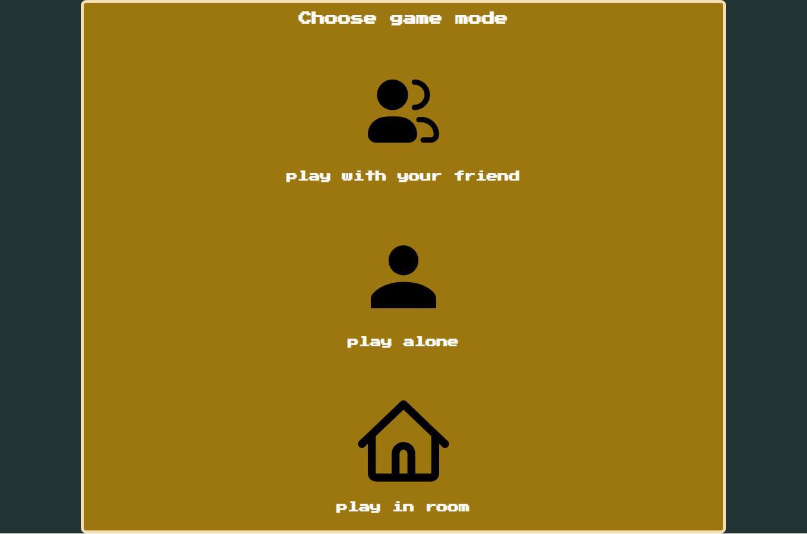
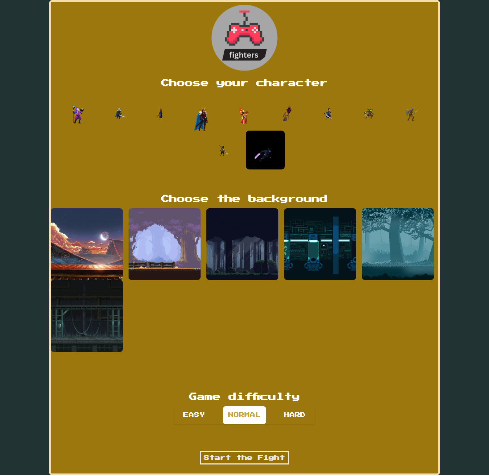

# Fighter game

_hello guys Zeyad is here_ is the the game, I made using JavaScript. its pretty simple to play :-

- ### to start playing:
  - choose the mode from the main page
  - then choose your character
  - the the background
  - then the difficulty (if you play in single player mode)
- ### the rooms mode is not completed yet but im still working on it
- ### the game is made is pure Js

# HERE is some images

#### *two player mode*
.png> "the figher")
#### *single player mode*
.png>)
#### *room mode (incompleted)*
.png> "the figher")
#### *main page*

#### *player names*
.png> "the figher")
#### *chooose the background*
.png> "the figher")
#### *choose the character*
.png> "the figher")
#### *one player mode choose*

<iframe width="100%" height="350" src="https://www.youtube.com/embed/V7SUIWf8Bjc" title="preview video" frameborder="0" allow="accelerometer; autoplay; clipboard-write; encrypted-media; gyroscope; picture-in-picture; web-share" allowfullscreen></iframe>

---

### Pages Explanation:

- ### The Main Page:
  - this is where you can select the mode between `Single Player` and `Multiplayer`.
  - there are many characters to choose from.

  - after selecting a character you will be asked to pick the background for that character.
    - currently we have many backgrouns for each character.

  - if you chose `Single Player` mode you will also need to select the Difficulty level which includes:
    - `Easy` 
    - `Medium`
    - `Hard`

#### Note: In Multiplayer mode only one player can control each character at a time so you should choose wisely.

- ### Room Mode:
  - This page is under development so far.
  - In this mode you will be able to create or join a room.
  - when creating a new room you will need to enter the room name and password.
  - once you created the room you will be redirected to the game page with your own room.
  - If you want to join an existing room you just need to enter the room's name and password.

